# Модуль интеграции 1С с поставщиками по API - инструкция

Источник: [Google Docs](https://docs.google.com/document/d/1cud4TAcxw8qylqZCw65x53OIS5t2WQ7oMFHy9NAODiE/edit). Забрано скриптом `seo-data/scripts/import_ecom_manual_0930.py`.

## Настройка работы системы

В основной конфигурации в справочнике “Данные авторизации” нужно добавить элемент, где указываем информацию об авторизации на веб-сервере. Обращаем внимание на формат адреса публикации, как в примере. В общих настройках загрузке указываем элемент спр. “Соответствия обменов с поставщиками”, можно добавить незаполненный.
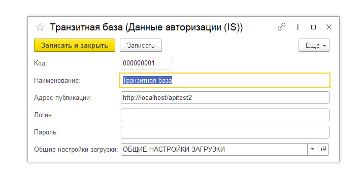

В справочнике ”Соответствия обменов с поставщиками” также прописываются настройки для всех поставщиков, с АПИ которых предполагается работа. Существуют следующие настройки, как указано на следующем изображении.

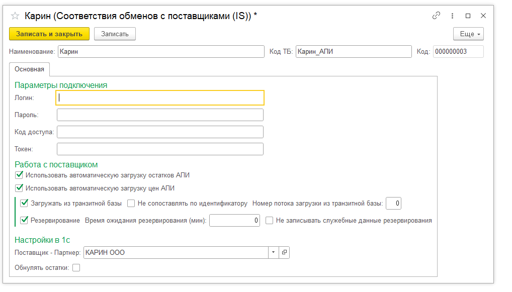

- Параметры подключения: Для каждого поставщика соотв. используются свои настройки работы с API как логин/пароль, так и коды доступа либо токены.
- Использовать автоматическую загрузку остатков АПИ: Загружать количество остатков у поставщика.
- Использовать автоматическую загрузку цен АПИ: Загружать цены товаров у поставщика. (если обе галки сняты, загрузка в прайс поставщика производиться не будет вообще).
- Загружать из транзитной базы: по сути включает и отключает загрузку всех данных по текущему поставщику из “транзитной” базы.
- Не сопоставлять по идентификатору: В исключительных ситуациях для некоторых поставщиков может ставиться, если идентификаторы товаров поставщика могут изменяться с течением времени.
- Номер потока загрузки из транзитной базы: в целях производительности, когда набирается много разных поставщиков, можно выбирать в какой поток загрузки (через регл. задания внешней обработки, соотв. имена потоков там есть) включать их.
- Резервирование: включает функционал резервирования для поставщика (если предусмотрено его документацией API)
- Время ожидания резервирования: принудительная задержка при выполнении запросов резервирования.
- Поставщик - Партнер: Поле обязательно для заполнения, определяет принадлежность настройки соотв. поставщику.
- Обнулять остатки: позволяет сбрасывать количество остатков при загрузке.
В основную конфигурацию нужно загрузить и настроить в соотв. с изображением ниже внешнюю обработку работы с регламентными заданиями, обеспечивающими работу системы. Включить поставщиков в соот. пакеты загрузчика.

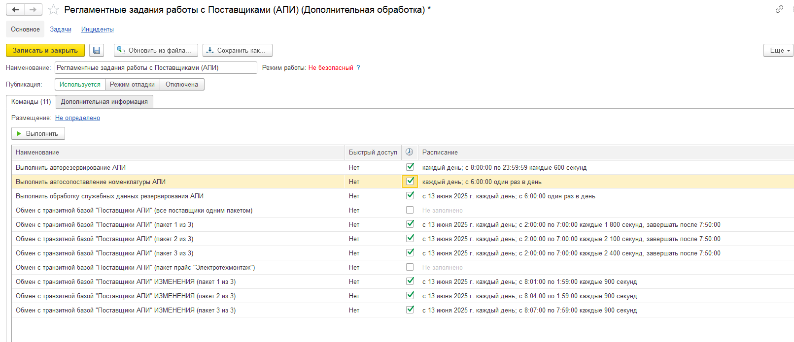

## Загрузка прайсов поставщиков

Если все сделано правильно, в информационную базу начнут поступать данные по прайсам поставщиков, загруженные через API. Проверить это можно следующим отчетом (если загружаются только изменения по прайсу, то это будет тут же видно, также как и различные ошибки при загрузке):
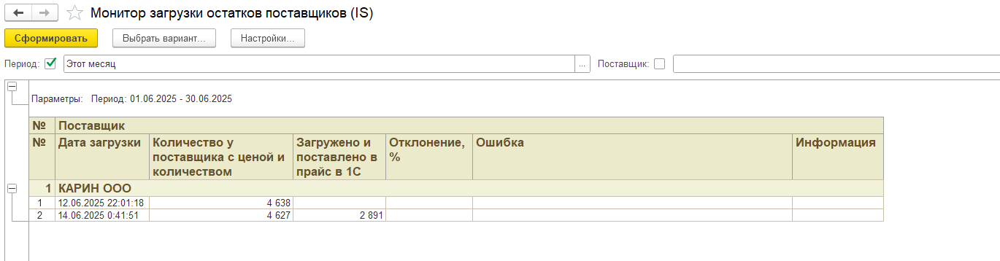

Сами данные прайса можно посмотреть с помощью этого отчета:
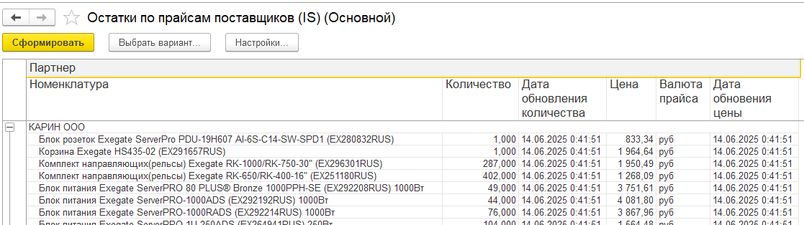
Для сопоставления номенклатуры поставщика с товарами в информационной базе, у позиций, где автоматически соответствия не проставились, нужно воспользоваться соответствующей обработкой, отобрать необходимые товары для поставщика, проставить соответствия (по артикулу либо вручную) и нажать “проставить соответствия”:
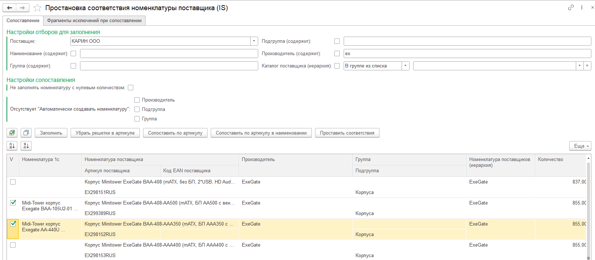

Для очистки этих соответствия используем эту обработку:
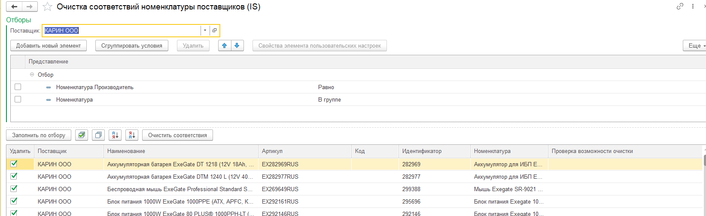

## Резервирование

При подборе товаров в “Заказ клиента” теперь доступна дополнительная колонка, с информаций о наличии этого товара у подключенных поставщиков.

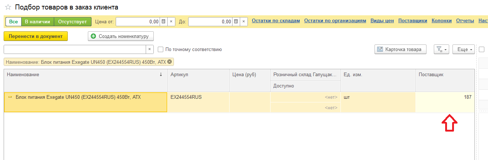

Для резервирования товаров у поставщиков автоматически через их API необходимо на основании “Заказа клиента” создать документ “Резерв у поставщика” (соотв. команда меню). Соотв. проверить, при необходимости отредактировать, таблицу с товарами, и провести документ. Регламентным заданием в ближайшее время будет произведено автоматически резервирование товара у подходящего поставщика по наиболее выгодным условиям, информация о резервировании (в т.ч. ошибки, при возникновении каких-то проблем) будет выведена в соотв. поле на вкладке резервирование товаров:
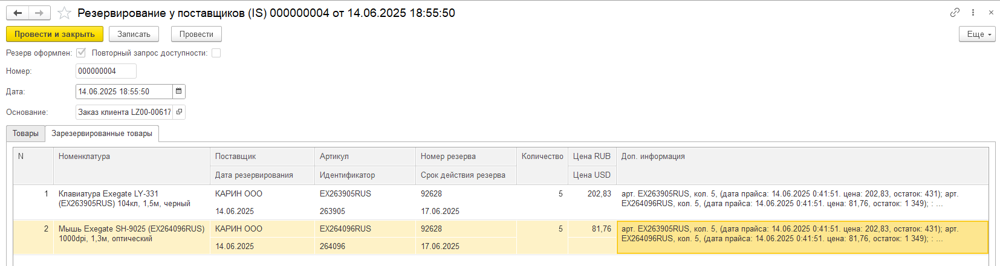

Сводную информацию по итогам резервирования за период можно посмотреть следующим отчетом. Если % ошибок 10-20, в принципе ничего серьезного и это допустимо. Если больше, то требуется разбираться корректностью работы API данного поставщика.
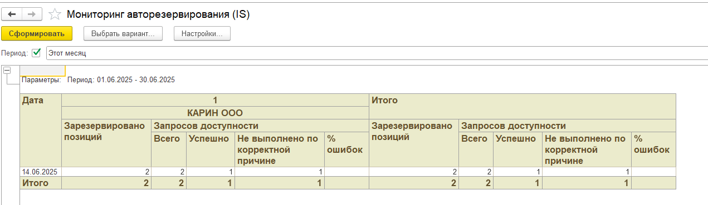
Более подробную информацию получить, в т.ч. разбор ошибок удобно проводить с помощью этого отчета (2 изображения):
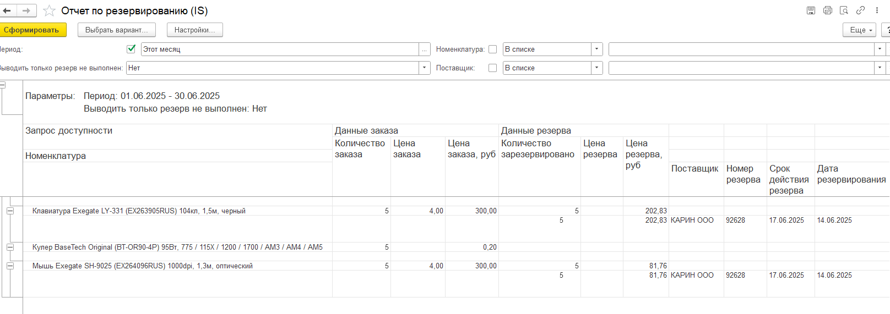

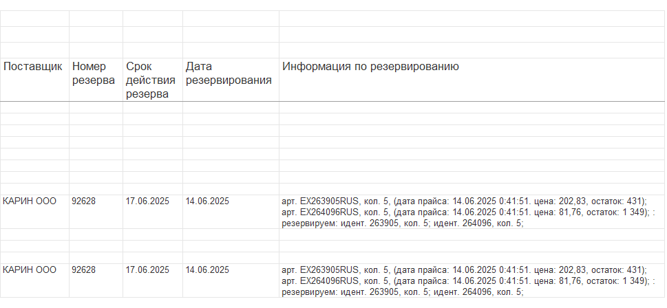
